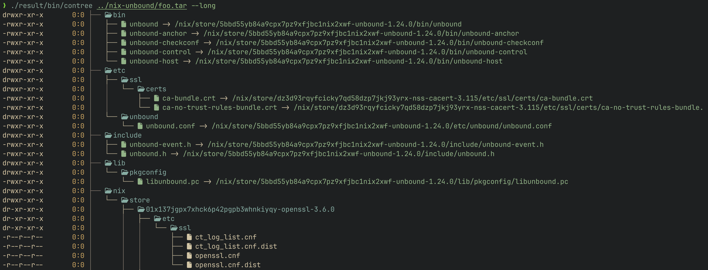

# contree

> Visualize the merged filesystem tree of Docker image archives



Contree is a command-line tool that renders the complete, merged filesystem of a Docker image archive (produced by `docker save`) as an ASCII tree. It streams large images efficiently, respects layer order from the manifest, handles Docker whiteouts correctly, and shows you exactly what files and directories would exist in the final container.

## Features

- **Complete metadata support**: Displays correct UID/GID, permissions, and ownership
- **Hard link detection**: Shows hard links with `=>` notation
- **Symlink support**: Displays symlink targets with `->` notation
- **Layer visualization**: Optional layer separators showing which layer added each file
- **Fast and efficient**: Single-pass streaming with minimal memory usage
- **Color themes**: Gruvbox Material Dark color scheme matching the Zig version
- **Flexible icons**: Nerd Font icons, emoji, or plain text
- **Docker whiteout handling**: Correctly processes `.wh.*` files for deletions

## Quick Start

### Installation with Nix (Recommended)

```bash
# Run directly without installing
nix run github:blark/contree -- image.tar

# Install to your profile
nix profile install github:blark/contree

# Or build locally
nix build
./result/bin/contree image.tar
```

### Build from Source

Requires Rust 1.70 or newer:

```bash
# Build release version
cargo build --release

# Binary will be at target/release/contree
./target/release/contree image.tar
```

### Basic Usage

```bash
# Export a Docker image
docker save alpine:latest > alpine.tar

# Visualize the merged filesystem
contree alpine.tar

# Show permissions and ownership
contree --long alpine.tar

# Show which layer added each file
contree --layers alpine.tar
```

## Command-Line Options

```
contree [OPTIONS] <FILE>

Arguments:
  <FILE>  Docker archive tar file to visualize

Options:
  -l, --long            Show permissions and ownership information
      --color <WHEN>    Colorize output: auto, always, never [default: auto]
      --icons <STYLE>   Icon style: none, emoji, nerd [default: nerd]
      --layers          Show layer separators with abbreviated hash
      --theme <JSON>    Custom theme as JSON string
  -h, --help            Print help
  -v, --version         Print version
```

### Example with Custom Theme (Kanagawa Dark)

```bash
contree image.tar \
  --long \
  --layers \
  --color always \
  --icons nerd \
  --theme '{
    "directory":"#7E9CD8",
    "executable":"#98BB6C",
    "symlink":"#7FB4CA",
    "tree_chars":"#54546D",
    "permissions":"#DCD7BA",
    "ownership":"#E6C384",
    "layer_separator":"#957FB8",
    "hardlink":"#727169"
  }'
```

## Understanding Docker Layers

Docker images are built from layers—each layer is a tarball that adds, modifies, or removes files from previous layers. Contree handles:

- **Layer ordering**: Applies layers in the correct order from `manifest.json`
- **Whiteout files**: Processes `.wh.*` markers that indicate deletions
- **Opaque directories**: Handles `.wh..wh..opq` markers that clear directory contents
- **File overlays**: Later layers override earlier ones correctly

## Color Scheme

Contree uses the **Gruvbox Material Dark** theme:

- **Directories**: Blue (`#7daea3`)
- **Executables**: Green (`#a9b665`)
- **Symlinks**: Cyan (`#89b482`)
- **Permissions**: Cream (`#ddc7a1`)
- **Ownership**: Yellow (`#d8a657`)
- **Tree structure**: Gray (`#928374`)
- **Layer separators**: Mauve (`#d3869b`)

## License

MIT License - see LICENSE file for details.
